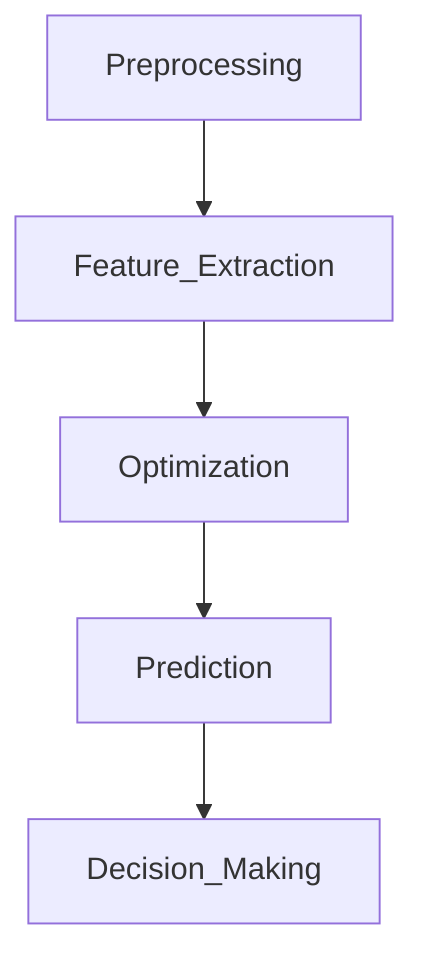
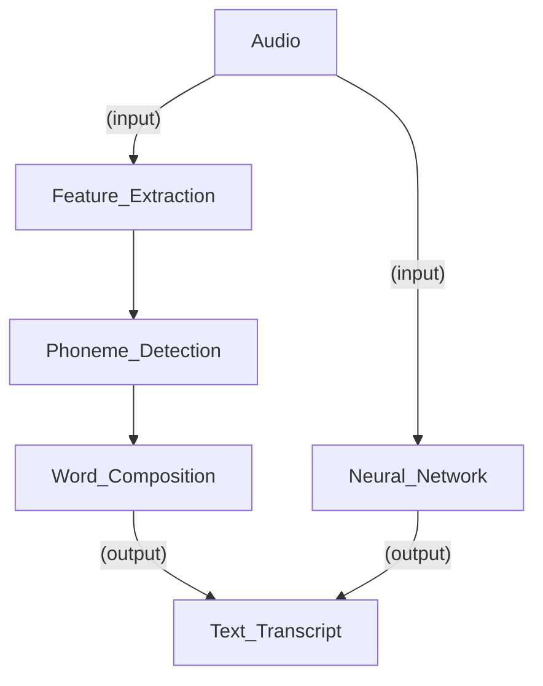

## 1.Why?

- For solving some problems(speech recognition and autonomous driving), we need an architecture consisting of **multi-layers**, each of which may be implemented **different algorithms**.
- For achieving better results, changes in the inner layers and its corresponding algorithms have to be applied. However, as **each layer is responsible to solve particular tasks**, it becomes really **difficult to determine how such changes will affect the system as a whole**.

## 2.Introduction

Tobias Glasmachers evidentiate how E2E is framed in the Deep Learning context:

> *“This elegant although straightforward and somewhat brute-force technique [E2E] has been popularized in the context of deep learning. It is a seemingly natural consequence of deep neural architectures blurring the classic boundaries between learning machine and other processing components **by casting a possibly complex processing pipeline into the coherent and flexible modeling language of neural networks***. ”*

## 3.Applications

### (1)Speech Recognition

#### Traditional Pipeline Vs. End-to-end Pipeline

- **Traditional:** Each module has to be **optimized separately** under different criteria.
- **E2E Approach:** 
  - Allowing the use of a **single optimization** criterion for enhancing the system.
  - Possible to design a model that performs well **without deep knowledge** about the problem, **despite its complexity**.

Ronan Collobert et al. explain how a unified Neural Network architecture and an appropriate learning algorithm for Natural Language Processing (NLP) can be used to **avoid task-specific engineering and lots of prior knowledge**:

>*“[…] we try to excel on* *multiple benchmarks* *while* *avoiding task-specific engineering**. Instead we use a* *single learning system* *able to discover adequate internal representations. […] Our desire to avoid task-specific engineered features prevented us from using a large body of linguistic knowledge. Instead we reach good performance levels in most of the tasks by transferring intermediate representations discovered on large unlabeled data sets. We call this approach “almost from scratch” to emphasize the reduced (but still important) reliance on a priori NLP knowledge. “*

### (2)Autonomous driving

#### Traditional: An autonomous driving system with 5 different layers

The input data comes from several sensors (cameras, LIDAR, radars, etc.) that are processed in the **sensor fusion** layer to extract the relevant features (e.g. object detection). With all the data processed and the relevant features extracted, a “**world model**” is created in the second layer. That model comprises the complete picture of the surrounding environment together with the vehicle internal state.

From this model, the system must choose which decisions to make in the **behavior layer**. According to the vehicle’s goals, it raises multiple behavior options based on the system policy and selects the best one by applying some optimization criterion.

With the decisions taken the system determines the maneuvers the vehicle must execute to satisfy the chosen behavior in the **planning** layer and, finally, the control values are sent to the actuator interface modules in the **vehicle control** layer.

#### An autonomous driving system

The system was able to learn **internal representations of intermediate steps**, such as detecting useful road features, with only the human steering angle as the training signal. The usage of Convolutional Neural Networks (CNNs) plays an important role in the proposed system for its capacity of extracting useful features from image data:

> *“The breakthrough of CNNs is that features are learned automatically from training examples. The CNN approach is especially powerful in image recognition tasks because the convolution operation captures the 2D nature of images.”*

The **designed CNN** goes beyond pattern recognition to **learn the entire processing pipeline** needed to steer an automobile. The network architecture consists of 9 layers, including a normalization layer, 5 convolutional layers, and 3 fully connected layers. The system was trained using real driving recorded data collected in central New Jersey, Illinois, Michigan, Pennsylvania, and New York. The following figure shows the block diagram of the training system design:

With approximately 72 hours of driving data, the system was able to learn how to steer the car in different road types and weather conditions.

## 4.Limitations

- **A huge amount of data is necessary**: The incorporation of some prior knowledge into the training is considered a key element that will allow an increase in performance in many applications. For E2E learning not integrating this prior knowledge, more training examples must be provided.
- **Difficult to improve or modify the system:** If some structural change must be applied (e.g. increasing the input dimensions by adding more features) the old model has no use and the hole DNN has to be replaced and trained all over again.
- **Highly efficient available modules cannot be used:** Many techniques are efficient to solve some tasks. As an example, state-of-the-art object recognition systems are largely distributed, but as soon as it is integrated into an E2E system, it cannot be considered E2E anymore.
- **Difficult to validate:** If a high level of validation is necessary, E2E may become infeasible. Due to the complex architecture, the potential number of input/output pairs can be big enough to make the validation impossible. This is especially important for some sectors like the automotive industry.

## 5.Reference

Source From: [Medium](https://towardsdatascience.com/e2e-the-every-purpose-ml-method-5d4f20dafee4)
